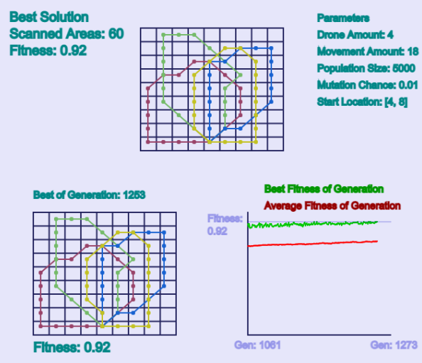

# Genetic Algorithm Visualization

This is a visualization of a genetic algorithm that finds paths for drones that scan an area. Fitness function is created to find a solution that has minimum turn angle, maximum scanned area and paths that turn back to the starting position.

## p5.js

The visualization is created with p5.js library.

https://p5js.org/
